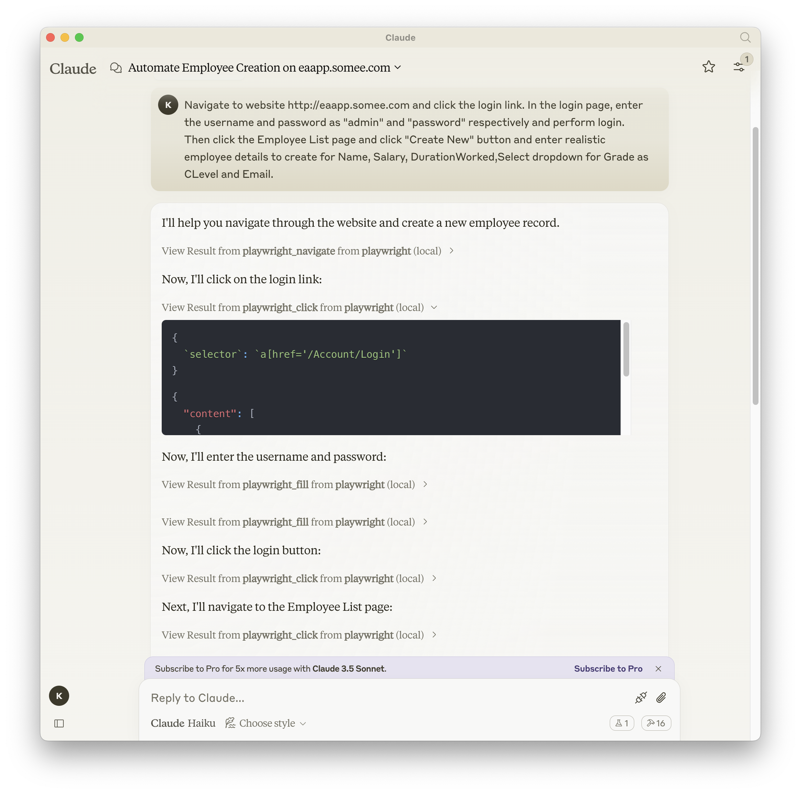

# Playwright MCP Server

[](https://smithery.ai/protocol/@executeautomation/playwright-mcp-server)

A Model Context Protocol server that provides browser automation capabilities using Playwright. This server enables LLMs to interact with web pages, take screenshots, and execute JavaScript in a real browser environment.

## Screenshot


## Installation

You can install the package using either npm, mcp-get, or Smithery:

### Installing via Smithery

To install Playwright MCP for Claude Desktop automatically via [Smithery](https://smithery.ai/protocol/@executeautomation/playwright-mcp-server):

```bash
npx @smithery/cli install @executeautomation/playwright-mcp-server --client claude
```

Using npm:
```bash
npm install -g @executeautomation/playwright-mcp-server
```

Using mcp-get:
```bash
npx @michaellatman/mcp-get@latest install @executeautomation/playwright-mcp-server
```

## Building from Source

If you want to build the code from source:

**Clone the repository**
```bash
git clone https://github.com/executeautomation/mcp-playwright.git
```

**Build the code**
First run npm install

```bash
npm install
```
Then run build and link

```bash
npm run build
npm link
```

## Configuration to use Playwright Server
Here's the Claude Desktop configuration to use the Playwright server:

```json
{
  "mcpServers": {
    "playwright": {
      "command": "npx",
      "args": ["-y", "@executeautomation/playwright-mcp-server"]
    }
  }
}
```


## Components

### Playwright Browser Tools

- **playwright_navigate**
  - Navigate to any URL in the browser
  - Input: `url` (string)

- **playwright_screenshot**
  - Capture screenshots of the entire page or specific elements
  - Inputs:
    - `name` (string, required): Name for the screenshot
    - `selector` (string, optional): CSS selector for element to screenshot
    - `width` (number, optional, default: 800): Screenshot width
    - `height` (number, optional, default: 600): Screenshot height

- **playwright_click**
  - Click elements on the page
  - Input: `selector` (string): CSS selector for element to click

- **playwright_hover**
  - Hover elements on the page
  - Input: `selector` (string): CSS selector for element to hover

- **playwright_fill**
  - Fill out input fields
  - Inputs:
    - `selector` (string): CSS selector for input field
    - `value` (string): Value to fill

- **playwright_select**
  - Select an element with SELECT tag
  - Inputs:
    - `selector` (string): CSS selector for element to select
    - `value` (string): Value to select

- **playwright_evaluate**
  - Execute JavaScript in the browser console
  - Input: `script` (string): JavaScript code to execute

### Playwright API Tools

- **playwright_get**
  - GET operation on any given API request
  - Inputs:
    - `url` (string): URL to perform GET operation
  - Response:
    - `statusCode` (string): Status code of the API

- **playwright_post**
  - POST operation on any given API request
  - Inputs:
    - `url` (string): URL to perform PUT operation
    - `value` (string): Data to post in the body
  - Response:
    - `statusCode` (string): Status code of the API
    - `responseData` (string): JSON format response data

- **playwright_put**
  - PUT operation on any given API request
  - Inputs:
    - `url` (string): URL to perform PUT operation
    - `value` (string): Data to put in the body
  - Response:
    - `statusCode` (string): Status code of the API
    - `responseData` (string): JSON format response data

- **playwright_patch**
  - PATCH operation on any given API request
  - Inputs:
    - `url` (string): URL to perform PATCH operation
    - `value` (string): Data to patch in the body
  - Response:
    - `statusCode` (string): Status code of the API
    - `responseData` (string): JSON format response data
    
- **playwright_delete**
  - DELETE operation on any given API request
  - Inputs:
    - `url` (string): URL to perform DELETE operation
  - Response:
    - `statusCode` (string): Status code of the API

### Resources

The server provides access to two types of resources:

1. **Console Logs** (`console://logs`)
   - Browser console output in text format
   - Includes all console messages from the browser

2. **Screenshots** (`screenshot://<n>`)
   - PNG images of captured screenshots
   - Accessible via the screenshot name specified during capture

## Key Features

- Browser automation
- Console log monitoring
- Screenshot capabilities
- JavaScript execution
- Basic web interaction (navigation, clicking, form filling)
