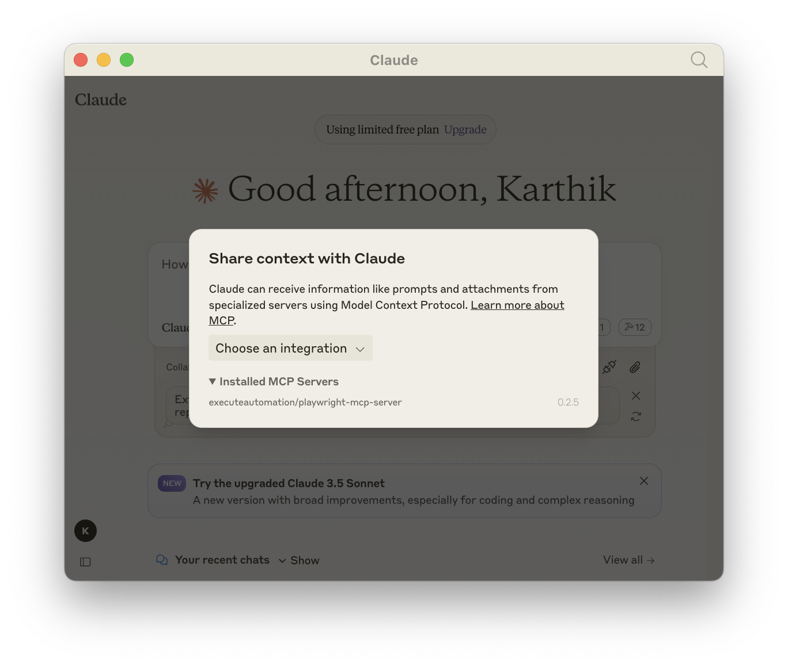

# Playwright MCP Server

The **Playwright Model Context Protocol (MCP) server** is a powerful solution for automating Browser and API testing using Playwright.

With the Playwright MCP server, you can:
	- Enable LLMs to interact with web pages in a real browser environment.
	- Perform tasks such as executing JavaScript, taking screenshots, and navigating web elements.
	- Seamlessly handle API testing to validate endpoints and ensure reliability.




## Installation
You can install Playwright MCP Server package using either **npm**, **mcp-get**, or **Smithery**:

:::info Playwright MCP Tips

To get started more quickly on Playwright MCP Server, watch the videos mentioned in the footer of this page under `Docs`

:::


### Installing via NPM
To install Playwright MCP for Claude Desktop automatically via Smithery:

```bash
npx npm install -g @executeautomation/playwright-mcp-server
```

### Installing via Smithery
To install Playwright MCP for Claude Desktop automatically via Smithery:

```bash
npx @smithery/cli install @executeautomation/playwright-mcp-server --client claude
```

You can type this command into Command Prompt, Powershell, Terminal, or any other integrated terminal of your code editor.

### Installing via MCP-GET
To install Playwright MCP for Claude Desktop automatically via Smithery:

```bash
npx @michaellatman/mcp-get@latest install @executeautomation/playwright-mcp-server
```

### Configuring Playwright MCP in Claude Desktop 
Here's the Claude Desktop configuration to use the Playwright MCP server.

Modify your `claude-desktop-config.json` file as shown below

```json
{
  "mcpServers": {
    "playwright": {
      "command": "npx",
      "args": ["-y", "@executeautomation/playwright-mcp-server"]
    }
  }
}
```
